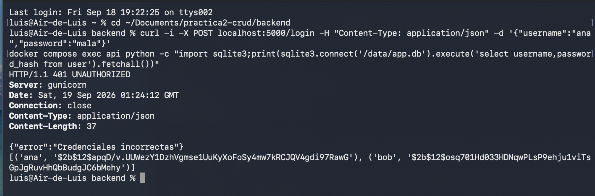
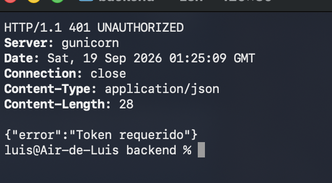
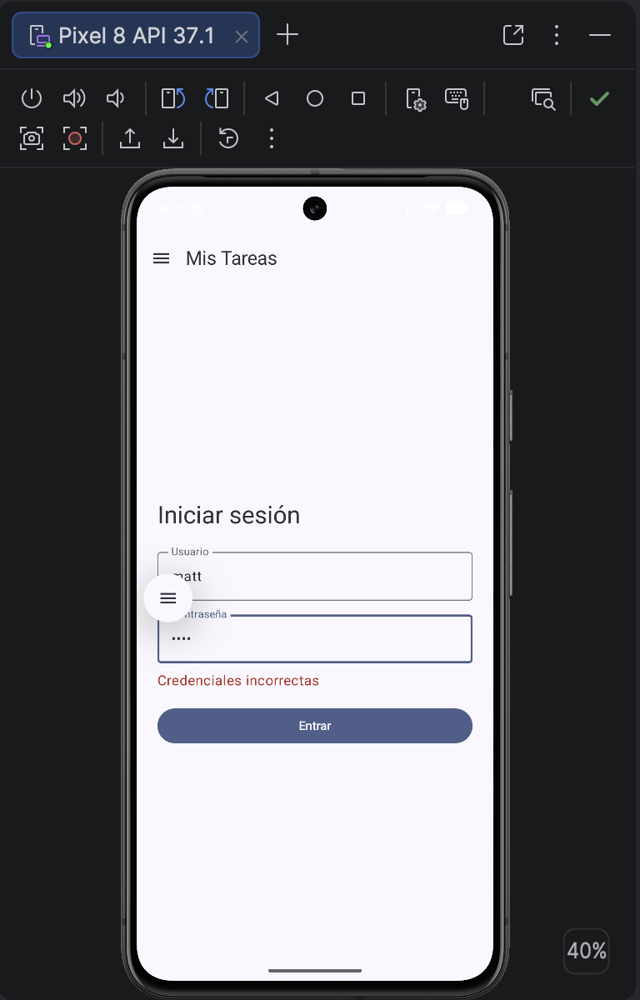
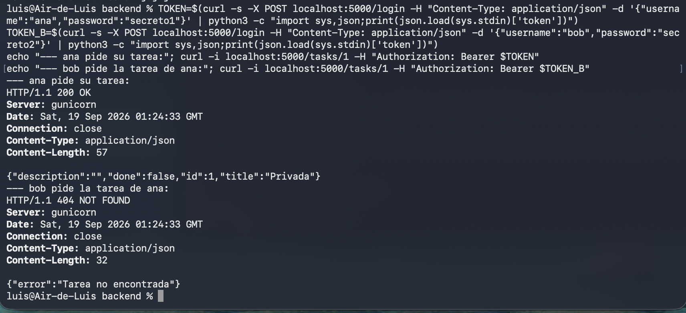
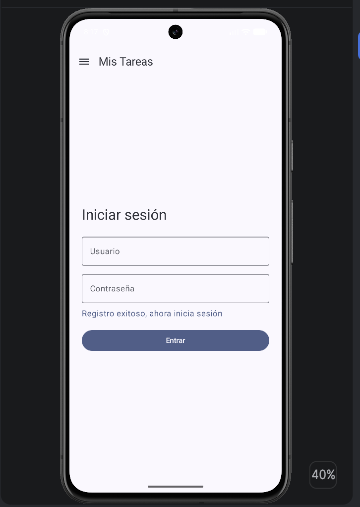
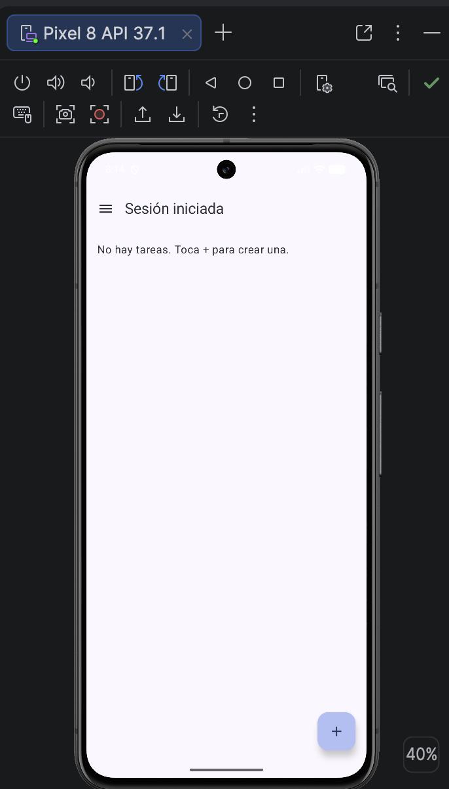
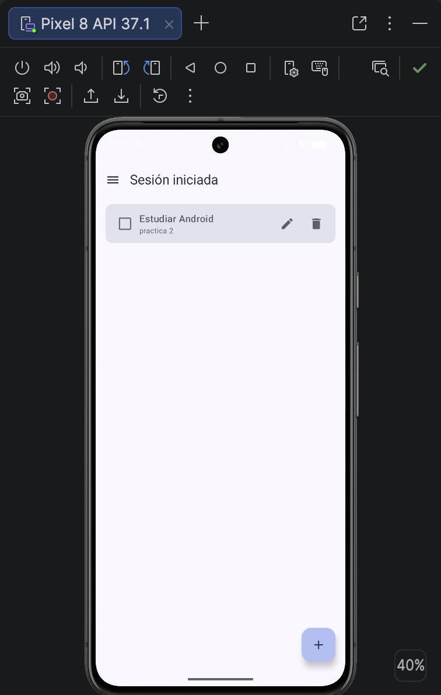
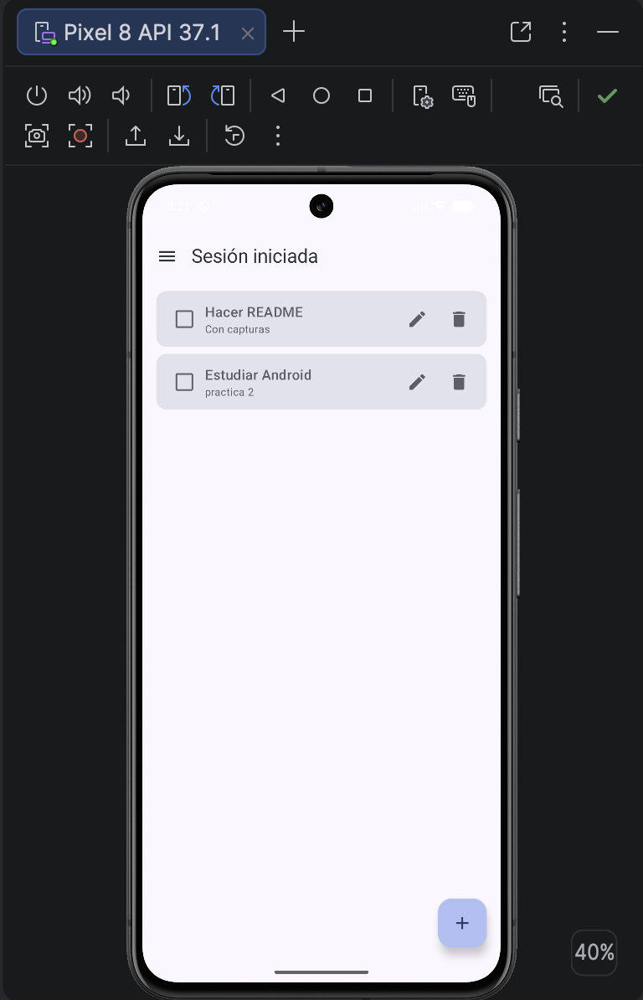
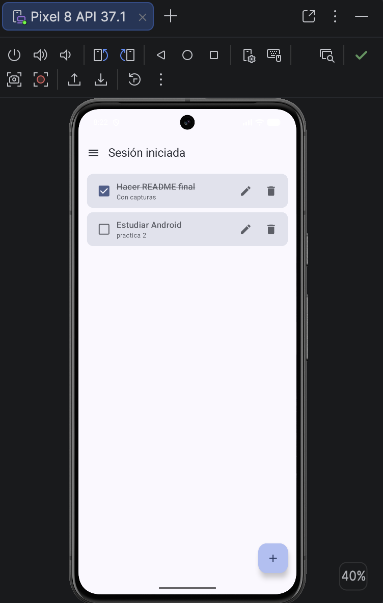
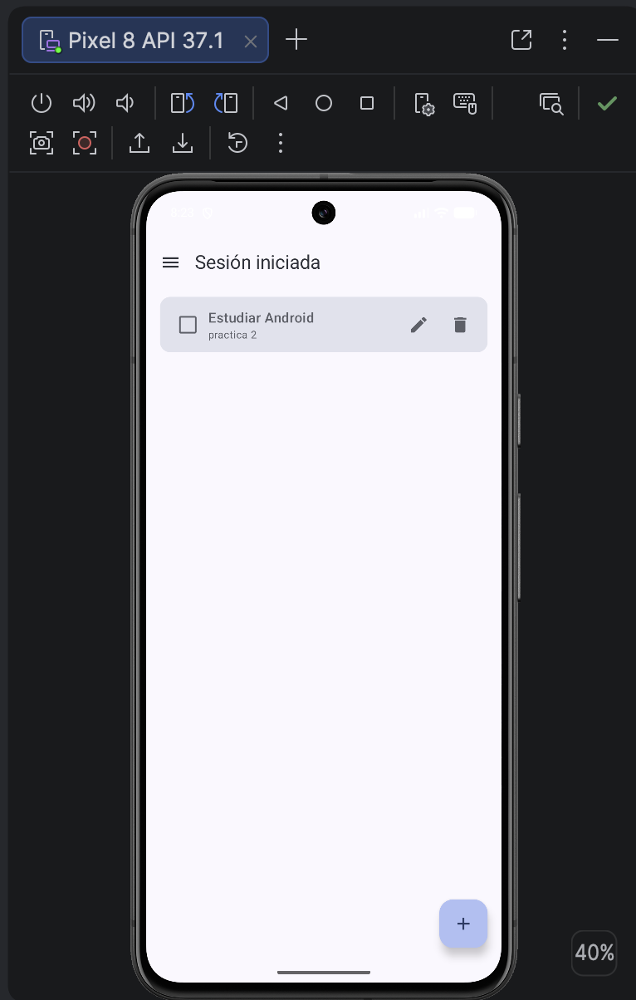

# Práctica 2: App móvil CRUD con servicio REST

## Portada

- **Nombre:** Rangel Mata José Luis
- **Boleta:** 2023630577
- **Grupo:** 7CV4
- **Asignatura:** Desarrollo de aplicaciones móviles nativas
- **Profesor:** Gabriel Hurtado Avilés
- **Fecha de entrega:** 18 de septiembre de 2026

## Inicio rápido (para el profesor)

Solo se necesita Docker instalado. No hay que crear `.env` ni configurar nada.

```bash
git clone https://github.com/LuisRan/Flask-Compose-Login-API.git
cd Flask-Compose-Login-API/backend
docker compose up --build
```

La API queda en `http://localhost:5000`. Para comprobarlo:

```bash
curl -i localhost:5000/
```

> En macOS el puerto 5000 puede estar ocupado por el "Receptor de AirPlay". Si Docker marca `address already in use`, se apaga en Ajustes del Sistema → General → AirDrop y Handoff.

## Introducción

Aplicación de **gestión de tareas** con registro e inicio de sesión. Cada usuario solo ve y modifica sus propias tareas.

**Stack y justificación**

| Capa | Tecnología | Por qué |
|---|---|---|
| Backend | Flask + Flask-SQLAlchemy + SQLite | Ligero, sin base de datos externa, ideal para levantar con un solo comando |
| Contraseñas | Flask-Bcrypt | Hash con sal, nunca texto plano |
| Sesiones | JWT firmado (PyJWT), expira en 2 h | Sesión sin estado, con expiración |
| Servidor | Gunicorn | Servidor de producción en lugar del servidor de desarrollo de Flask |
| Contenedores | Docker + Docker Compose | Reproducible en cualquier equipo |
| App | Kotlin + Jetpack Compose (Material 3) | Requisito de la práctica |
| Red | Retrofit + OkHttp + Gson | Cliente HTTP estándar en Android |
| Token en el teléfono | EncryptedSharedPreferences | El token se guarda cifrado |

### Punto de partida

Este proyecto parte del repositorio de ejemplo [gabrielhuav/Flask-Compose-Login-API](https://github.com/gabrielhuav/Flask-Compose-Login-API) (fork).

**Archivos modificados o agregados**

| Archivo | Cambio |
|---|---|
| `backend/app.py` | Reescrito: JWT, CRUD de tareas, aislamiento por usuario, llave autogenerada |
| `backend/requirements.txt` | Se agregan PyJWT y gunicorn |
| `backend/Dockerfile` | Python 3.12 slim y gunicorn |
| `backend/docker-compose.yml` | Volumen persistente y variables de entorno opcionales |
| `backend/.env.example` | Nuevo: nombres de variables, sin valores |
| `backend/.gitignore` | Nuevo |
| `backend/instance/site.db`, `backend/curl.txt` | Eliminados (base de datos y archivo del ejemplo) |
| `Android/FlaskLogin/app/build.gradle.kts` | Retrofit, navegación, security-crypto, `BASE_URL` |
| `Android/FlaskLogin/app/src/main/AndroidManifest.xml` | Permiso INTERNET y cleartext |
| `Android/FlaskLogin/app/src/main/java/ovh/gabrielhuav/flasklogin/Api.kt` | Nuevo: modelos, Retrofit, sesión cifrada |
| `.../MainViewModel.kt` | Nuevo: estados de carga, error y sesión |
| `.../Screens.kt` | Nuevo: login, registro y CRUD |
| `.../MainActivity.kt` | Reescrito: menú lateral y navegación |
| `docs/` | Capturas de pantalla |

## Desarrollo

### Conceptos (con mis palabras)

TODO: escribe 2 o 3 líneas por concepto, con tus palabras.

- **Docker:** TODO
- **Imagen y contenedor:** TODO
- **Dockerfile:** TODO
- **docker-compose.yml:** TODO
- **Backend / servicio REST:** TODO
- **ORM y base de datos:** TODO

### Dockerfile línea por línea

| Instrucción | Qué hace |
|---|---|
| `FROM python:3.12-slim` | TODO |
| `WORKDIR /app` | TODO |
| `COPY requirements.txt .` | TODO |
| `RUN pip install --no-cache-dir -r requirements.txt` | TODO |
| `COPY . .` | TODO |
| `EXPOSE 5000` | TODO |
| `CMD ["gunicorn", ...]` | TODO |

### docker-compose.yml línea por línea

| Línea | Qué hace |
|---|---|
| `services: api:` | TODO |
| `build: .` | TODO |
| `ports: "5000:5000"` | TODO |
| `environment:` | TODO |
| `volumes: api_data:/data` | TODO |
| `restart: unless-stopped` | TODO |

### Endpoints

URL base: `http://localhost:5000`. Los endpoints protegidos requieren el encabezado `Authorization: Bearer <token>`.

| Método | Ruta | Token | Body | Respuesta | Códigos |
|---|---|---|---|---|---|
| GET | `/` | No | - | `{"status":"ok"}` | 200 |
| POST | `/register` | No | `{username, password}` | `{message}` | 201, 400, 409 |
| POST | `/login` | No | `{username, password}` | `{token, username}` | 200, 401 |
| GET | `/tasks` | Sí | - | lista de tareas | 200, 401 |
| GET | `/tasks/{id}` | Sí | - | tarea | 200, 401, 404 |
| POST | `/tasks` | Sí | `{title, description}` | tarea | 201, 400, 401 |
| PUT | `/tasks/{id}` | Sí | `{title, description, done}` | tarea | 200, 400, 401, 404 |
| DELETE | `/tasks/{id}` | Sí | - | `{message}` | 200, 401, 404 |

**Ejemplos reales**

Registro:
```bash
curl -i -X POST localhost:5000/register -H "Content-Type: application/json" -d '{"username":"ana","password":"secreto1"}'
```
```json
{"message":"Usuario registrado"}
```

Login:
```bash
curl -i -X POST localhost:5000/login -H "Content-Type: application/json" -d '{"username":"ana","password":"secreto1"}'
```
```json
{"token":"<JWT>","username":"ana"}
```

Crear tarea:
```bash
curl -i -X POST localhost:5000/tasks -H "Authorization: Bearer $TOKEN" -H "Content-Type: application/json" -d '{"title":"Estudiar","description":"Moviles"}'
```
```json
{"description":"Moviles","done":false,"id":1,"title":"Estudiar"}
```

Listar, actualizar y borrar:
```bash
curl -i localhost:5000/tasks -H "Authorization: Bearer $TOKEN"
curl -i -X PUT localhost:5000/tasks/1 -H "Authorization: Bearer $TOKEN" -H "Content-Type: application/json" -d '{"done":true}'
curl -i -X DELETE localhost:5000/tasks/1 -H "Authorization: Bearer $TOKEN"
```
```json
[{"description":"Moviles","done":false,"id":1,"title":"Estudiar"}]
{"description":"Moviles","done":true,"id":1,"title":"Estudiar"}
{"message":"Tarea eliminada"}
```

Errores:
```json
{"error":"Token requerido"}
{"error":"Credenciales incorrectas"}
{"error":"Tarea no encontrada"}
```

### Ejecución de la app Android

1. Levantar el backend (sección "Inicio rápido").
2. Abrir `Android/FlaskLogin` con Android Studio (JDK 17 o 21) y esperar el Gradle sync.
3. Ejecutar en un emulador (Run ▶).

**URL base:** se define en `Android/FlaskLogin/app/build.gradle.kts`:

```kotlin
buildConfigField("String", "BASE_URL", "\"http://10.0.2.2:5000/\"")
```

- Emulador: `10.0.2.2` (dentro del emulador, `localhost` es el propio emulador).
- Dispositivo físico: cambiar por la IP local de la computadora, por ejemplo `http://192.168.1.10:5000/`.

Como la API se consume por HTTP en desarrollo, el manifest declara `android:usesCleartextTraffic="true"` y el permiso `INTERNET`.

### Seguridad

- **Contraseñas:** hash bcrypt con sal (`$2b$12$...`). Nunca se guardan en texto plano.
- **Sesiones:** JWT firmado (HS256) con expiración de 2 horas.
- **Secretos fuera del repositorio:** la llave del JWT se genera sola en el primer arranque y se guarda en un volumen de Docker. Opcionalmente se puede fijar con la variable `JWT_SECRET` (ver `backend/.env.example`). No hay `.env` ni llaves en el repo.
- **Endpoints protegidos:** responden 401 sin token válido o con token expirado.
- **Aislamiento por usuario:** cada consulta filtra por `user_id`. Un usuario no puede leer, editar ni borrar tareas de otro (recibe 404).
- **En el teléfono:** el token se guarda cifrado con EncryptedSharedPreferences. Si el servidor responde 401, la app cierra la sesión.
- **Limitación conocida:** en desarrollo el tráfico va por HTTP sin TLS. En producción se debe usar HTTPS.

### QA

| Prueba | Esperado | Obtenido | Evidencia |
|---|---|---|---|
| Contraseña guardada en la BD | Hash bcrypt, no texto plano | Correcto |  |
| `GET /tasks` sin token | 401 | Correcto |  |
| Login con contraseña incorrecta | 401 "Credenciales incorrectas" | Correcto |  |
| Usuario B pide una tarea de A | 404 | Correcto |  |
| Registro de usuario nuevo | 201 y mensaje en la app | Correcto |  |
| Login correcto | Pantalla de tareas | Correcto |  |
| Crear tarea | 201 y aparece en la lista | Correcto |  |
| Leer tareas | 200 y lista | Correcto |  |
| Actualizar tarea | 200 y cambio visible | Correcto |  |
| Borrar tarea | 200 y desaparece | Correcto |  |

### Capturas de la app

**Registro**


**Inicio de sesión correcto**


**Credenciales incorrectas**


**Crear**


**Leer**


**Actualizar**


**Borrar**


## Conclusiones

TODO: retos y logros con tus palabras. Ideas reales que te pasaron:

- El puerto 5000 ocupado por AirPlay en macOS.
- `10.0.2.2` en lugar de `localhost` desde el emulador.
- El error de JDK 25 con Gradle 8.13 en Android Studio.
- Generar la llave JWT automáticamente para que el profe no configure nada.

## Bibliografía

TODO: en formato APA. Base para completar:

- Docker Inc. (s. f.). *Docker documentation*. https://docs.docker.com
- Pallets. (s. f.). *Flask documentation*. https://flask.palletsprojects.com
- SQLAlchemy. (s. f.). *SQLAlchemy documentation*. https://docs.sqlalchemy.org
- Square. (s. f.). *Retrofit*. https://square.github.io/retrofit
- Google. (s. f.). *Jetpack Compose*. https://developer.android.com/compose
- gabrielhuav. (s. f.). *Flask-Compose-Login-API* [Repositorio]. GitHub. https://github.com/gabrielhuav/Flask-Compose-Login-API
